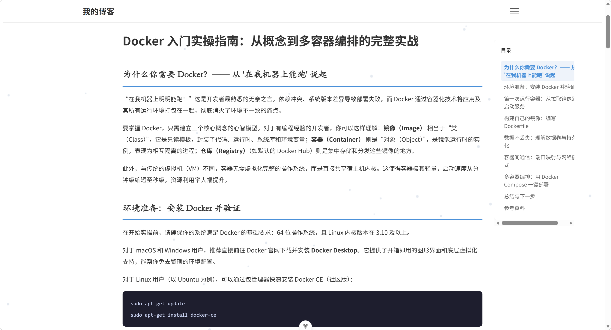
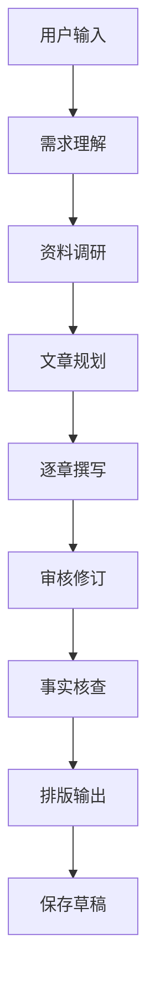

# AI Blog Assistant

> 帮助你记录想法、分享知识的智能博客助手。

## 项目简介

你是否有很多想分享的技术经验和个人思考，
却因为表达能力不足、写作耗时或者缺少整理能力，
始终没有将这些内容沉淀下来？

你是否拥有一颗乐于分享的心，
但面对空白的 Markdown 编辑器，不知道从何下笔？

**AI Blog Assistant** 希望解决这些问题。

它能够根据你提供的主题、想法和目标，
自动完成**资料整理、文章规划、内容撰写和持续优化**，
帮助你快速将零散想法转化为结构完整、内容丰富的技术博客。

项目基于 **LangGraph** 构建，通过工作流驱动多个 AI Agent 协同完成博客创作，
而非简单的一次 Prompt 生成。

## 项目展示



**用户输入：**

> 帮我写一篇关于 LangGraph Agent 架构设计的博客，面向有 Python 基础的开发者，3000 字左右。

**AI Blog Assistant：**

```
主题分析 → 资料调研 → 文章规划 → 逐章撰写 → 审核修订 → 排版输出
```

最终生成一篇包含代码示例和架构图的完整技术博客，自动保存为草稿。

## 系统架构



系统将博客创作过程拆分为多个阶段，每个阶段由专门的 Agent 负责，通过 LangGraph 进行流程编排和状态管理。

## 核心流程

### 1. 需求理解

分析用户想写的主题、目标读者、文章类型和写作要求，通过多轮对话逐步澄清需求。

### 2. 资料整理

通过外部搜索工具（Google、百度、网页阅读）获取相关资料，辅助文章内容更加准确和丰富。

### 3. 文章规划

根据主题和资料生成完整文章结构，包括标题、章节划分和每章核心要点。

### 4. 内容生成

按照大纲逐章节生成 Markdown 正文，每个章节独立撰写，保证结构清晰、内容充实。

### 5. 优化输出

审核文章逻辑连贯性、事实准确性和阅读体验，自动修订问题后输出可发布的博客正文。

## 项目特点

### 工作流驱动

不同于简单的一次 Prompt 生成，系统模拟真实博客创作流程，通过多个阶段协同完成，每一步都可以被观察和干预。

### 资料增强

结合外部信息检索，降低大模型生成内容的事实错误和幻觉问题。

### 结构化写作

先规划大纲再逐章节撰写，每一章有明确的要点和字数目标，文章质量可控。

### 质量闭环

内置审核-修订机制，自动检查内容质量并修正问题，确保输出达到可发布标准。

## 技术栈

### Backend

- Python / FastAPI
- LangGraph（工作流编排）
- LangChain（LLM 调用封装）
- MySQL + SQLModel

### LLM

- 通义千问 (Qwen)
- OpenAI API 兼容接口
- 支持切换 DeepSeek 等模型

### Tools

- Serper Google Search
- 百度千帆 AI Search
- Jina Reader（网页内容抓取）

### Frontend

- Vue 3 + TypeScript
- Vite

## 项目结构

```
backend/app/
├── workflow/
│   ├── graph.py              # LangGraph 主图
│   ├── routes.py             # 条件路由
│   ├── state.py              # 状态定义
│   └── nodes/                # Agent 节点
│       ├── intent_classifier.py
│       ├── requirement_analyzer.py
│       ├── research.py
│       ├── planner.py
│       ├── writer.py
│       ├── reviewer.py
│       ├── revision.py
│       ├── factcheck.py
│       └── assembler.py
├── tools/                    # 外部工具
│   ├── web_search.py
│   ├── baidu_search.py
│   └── fetch_page.py
├── prompts/nodes/            # Prompt 模板
├── api/admin/                # 后台 API
└── models/                   # 数据模型
```

## 快速开始

### 环境要求

- Python 3.12+
- Node.js 20+
- MySQL 8.0+

### 安装

```bash
git clone https://github.com/feixinwen/blog.git
cd blog/backend
pip install -r requirements.txt
```

### 配置

```bash
cp .env.example .env
```

编辑 `.env`，填入必要的 API Key：

```
QWEN_API_KEY=你的通义千问密钥
SERPER_API_KEY=你的Serper密钥（可选，用于Google搜索）
JINA_API_KEY=你的Jina密钥（可选，用于网页阅读）
BAIDU_SEARCH_API_KEY=你的百度千帆密钥（可选，用于中文搜索）
```

### 启动

```bash
# 后端
cd backend
uvicorn app.main:app --reload --port 8000

# 前端（新终端）
cd frontend
npm install
npm run dev
```

访问 `http://localhost:5173` 查看博客，`http://localhost:5173/admin/chat` 进入 AI 创作助手。

## Roadmap

- [x] 基础博客生成流程（需求 → 研究 → 规划 → 写作 → 输出）
- [x] Web 资料检索（Google / 百度 / 网页抓取）
- [x] LangGraph 工作流编排（11 节点 + 条件路由）
- [x] 质量审核 + 自动修订闭环
- [x] 事实核查
- [x] SSE 流式输出 + 思考过程可视化
- [x] 一键保存草稿到博客系统
- [ ] 用户个人知识库（历史文章学习）
- [ ] 自动生成配图 / 流程图
- [ ] 自动发布到博客平台
- [ ] 多语言博客生成
- [ ] 对话记录云端同步

## License

MIT
